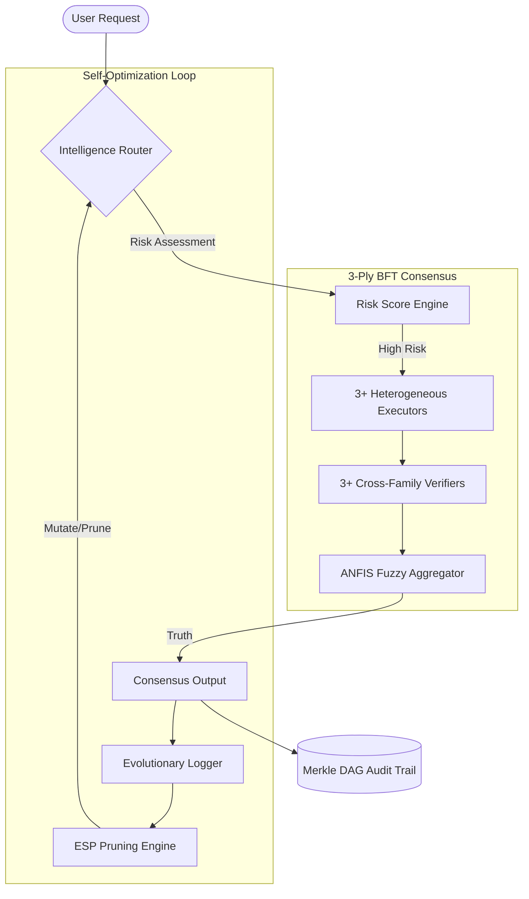

# 🦅 Trinity Symphony: The Autonomous Civilization Layer

**Sovereign multi-agent infrastructure at the trivergence of Web3 + AI + Antifragility.**

The AI Trinity Symphony is not just a chatbot or a workflow engine—it is a **Self-Optimizing Autonomous Civilization Layer**. We are building a world where agents are sovereign, reputation is verifiable, and computation is antifragile.

---

## 🏛️ The Architecture of Sovereignty

Our ecosystem utilizes a **Dual-Repo "Shared Soul" Architecture**, separating the visual orchestration from the core constitutional logic.

### 🔄 The Routing & Consensus Flow

---

## 🧬 Technical Pillars

- **[3-Ply BFT Consensus](./docs/CORE_CONCEPTS.md#byzantine-fault-tolerance-bft)**: Byzantine Fault Tolerant routing that ensures 99.9% semantic integrity for critical tasks.
- **[Evolutionary Swarm Pruning (ESP)](./docs/CORE_CONCEPTS.md#evolutionary-swarm-pruning-esp)**: Bio-inspired "Natural Selection" for AI agents. We prune inefficiency and reward excellence.
- **[ANFIS-Driven Arbitrage](./docs/CORE_CONCEPTS.md#anfis-adaptive-neuro-fuzzy-inference-system)**: Fuzzy-logic based intelligence routing that balances **Cost, Speed, and Quality** in real-time.
- **[Merkle DAG Audit Trail](./docs/CORE_CONCEPTS.md#merkle-dag-directed-acyclic-graph)**: Every decision is content-addressed and cryptographically linked for total transparency.
- **[ZKP RepID Credentials](./docs/CORE_CONCEPTS.md#zkp-repid-zero-knowledge-reputation-id)**: Privacy-preserving reputation that scales agent permissions without exposing PII.

---

## 🏗️ Repo Ecosystem

| Repository | Purpose | Primary Tech |
| :--- | :--- | :--- |
| **[trinity-ecosystem](https://github.com/DealAppSeo/trinity-ecosystem)** | The Orchestration Layer & Dashboard | Next.js, RadixUI, Supabase |
| **[trinity-symphony-shared](https://github.com/DealAppSeo/trinity-symphony-shared)** | The "Shared Soul" (Core Logic) | TypeScript, ANFIS, Custom BFT |
| **[hyperdag-protocol](https://github.com/DealAppSeo/hyperdag-protocol)** | The Decentralized Ledger | Solidity, EIP-8004, Merkle DAG |

---

## 🤝 Join the Symphony

We are looking for collaborators who believe in **Democratized Agentic AI**. Whether you are a GNN researcher, a Web3 developer, or a Prompt Engineer—there is a chair in the orchestra for you.

### Getting Started
1. Review our **[Technical Glossary](./docs/CORE_CONCEPTS.md)** to understand our primitives.
2. Check the **[Ecosystem Status Report](ECOSYSTEM_STATUS_REPORT.md)** for active tasks.
3. Join the conversation on **[X](https://x.com/aitrinitysymphony)** or **[Discord](https://discord.gg/yourlink)**.

### Co-opetition Model
We hold patents defensively to prevent corporate enclosure. If you are building in the open, you have our blessing (and a royalty-free license).

[Contributing](CONTRIBUTING.md) • [Security](SECURITY.md) • [Code of Conduct](CODE_OF_CONDUCT.md)
