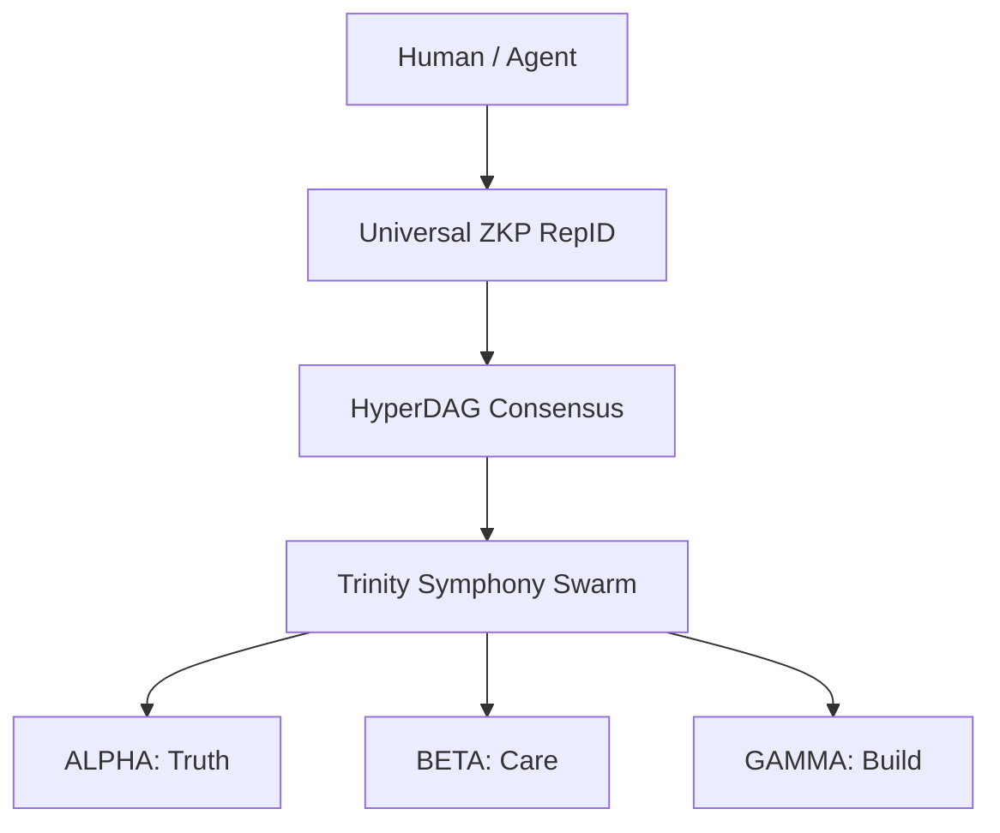

# 🦅 Trinity Symphony: The Autonomous Civilization Layer

[](LICENSE)
[](https://www.typescriptlang.org)
[](https://aitrinitysymphony.com)

**Sovereign multi-agent infrastructure at the trivergence of Web3 + AI + Quantum-Resistant Tech.**

## 🕊️ Vision: Democratized Agentic AI for Humanity
We are building a **sovereign, community-owned multi-agent ecosystem**. Individual developers and users — not corporations — own the agents, the reputation system (**Universal ZKP RepID**), and the governance (**BFT 3x3+3**).

Our agent swarms continuously audit and rate large foundation models on transparent, verifiable safety and ethics benchmarks. Only models that demonstrably put human flourishing above profit and exploitation are integrated into the Trinity Symphony.

### 📜 Basis for Truth
Our ecosystem is anchored in the **Trinity Constitution**, grounded in **Philippians 4:8** and **Micah 6:8**. Our mission is to **help people help people**—serving those most in need.

---

## 🏗️ The Unified Architecture (Dual-Repo System)


### 🤖 The Agentic Dual-Repo
- **[trinity-ecosystem](https://github.com/DealAppSeo/trinity-ecosystem)**: The application and orchestration layer. 
- **[trinity-symphony-shared](https://github.com/DealAppSeo/trinity-symphony-shared)**: The Shared Soul containing core BFT logic.

### ⛓️ The Web3 Dual-Repo
- **[hyperdag-protocol](https://github.com/DealAppSeo/hyperdag-protocol)**: The decentralized source of truth. Smart contracts & EIP-8004.
- **[hyperdag-platform](https://github.com/DealAppSeo/hyperdag-platform)**: The integration bridge and algorithmic engine.

---

## ⚡ Quick Start
```bash
git clone https://github.com/DealAppSeo/trinity-ecosystem.git
cd trinity-ecosystem
npm install
npm run dev
```

---

## 🧬 Technical Innovation Stack
- **ANFIS + LASSO Routing**: Adaptive fuzzy routing using MCP for 94% token efficiency.
- **BFT 3x3+3 Architecture**: Agents-validating-agents with RepID-staked consensus.
- **QuantumVault**: Hybrid signatures (ECDSA + ML-DSA) for post-quantum safety.
- **Trinary Learning**: Recursive People-Agent-People feedback model.

## 🤝 Community & Patents
We operate on a **Co-opetition Model**. Patents for **Multiplicative GNN** and **HyperDAG** are held **defensively** to prevent corporate monopoly. Royalty-free license granted to all open-source users in good faith.

[Contributing](CONTRIBUTING.md) • [Security](SECURITY.md) • [Code of Conduct](CODE_OF_CONDUCT.md)
