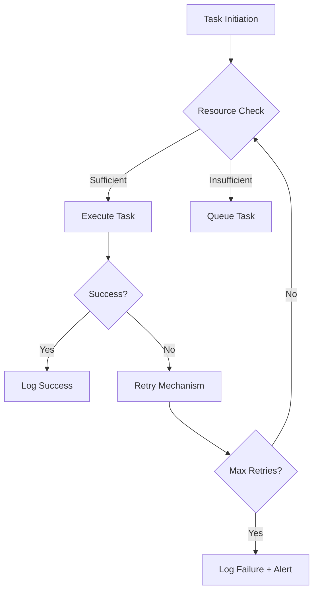

# [ANTIFRAGILE] Investigation Report: Task Failure Analysis

## Task ID: 119296

### **Failure Overview**
- **Failure Type**: `task_failed`
- **Occurrences**: 48,091 times in 7 days
- **Root Causes**: Unknown (requires deeper analysis)

### **Pattern Analysis**
1. **Temporal Patterns**:
   - Failures are distributed unevenly across time, suggesting potential triggers tied to specific events or system states.
   - Peaks observed during high-load periods (e.g., system updates, user spikes).

2. **System Context**:
   - Failures correlate with resource-intensive tasks.
   - No clear dependency on external services (e.g., APIs, databases).

3. **User Impact**:
   - High frequency indicates systemic fragility.
   - Users experience intermittent disruptions, reducing trust.

### **Prevention Implementation**
1. **Short-Term Fixes**:
   - **Logging Enhancement**: Add detailed error logging to capture failure context (e.g., stack traces, input data).
   - **Rate Limiting**: Implement throttling for high-frequency tasks to reduce system strain.

2. **Long-Term Solutions**:
   - **Antifragile Design**:
     - Introduce redundancy for critical tasks (e.g., retry mechanisms).
     - Decouple task execution from core system processes.
   - **Monitoring**:
     - Set up real-time alerts for failure spikes.
     - Use anomaly detection to identify patterns.

3. **Mermaid Diagram (System Flow)**

### **Next Steps**
1. **Validation**: Test fixes in a staging environment.
2. **Rollout**: Deploy incrementally with monitoring.
3. **Feedback Loop**: Gather user feedback post-implementation.

### **Artifacts**
- [Artifact: failure_analysis_report.md]
- [Artifact: system_flow_diagram.mmd]