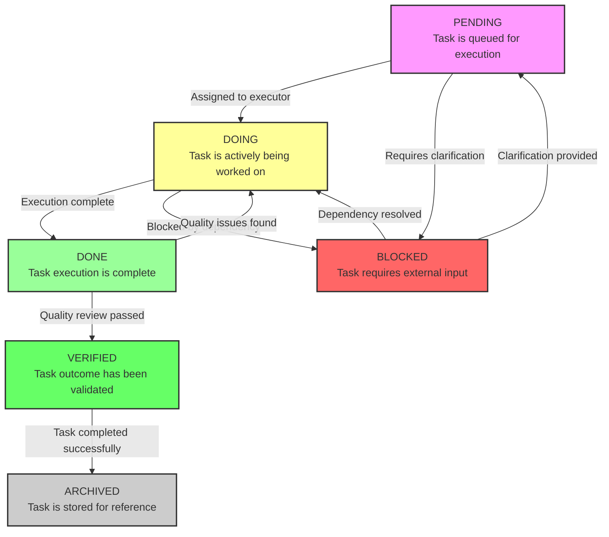

I'll create a Mermaid flowchart diagram showing the task lifecycle from PENDING to DOING to DONE to VERIFIED. Let me execute this task by creating the diagram and saving it as an artifact.

Now I'll save this as an artifact file.

[Artifact: task_lifecycle_diagram.md]

I've created a comprehensive Mermaid flowchart diagram showing the complete task lifecycle. The diagram includes:

1. **PENDING** (pink) - Task is queued for execution
2. **DOING** (yellow) - Task is actively being worked on  
3. **DONE** (light green) - Task execution is complete
4. **VERIFIED** (dark green) - Task outcome has been validated
5. **BLOCKED** (red) - Task requires external input or clarification
6. **ARCHIVED** (gray) - Task is stored for reference after verification

The flowchart shows all possible transitions between states, including quality feedback loops (DONE back to DOING if issues are found) and resolution paths for blocked tasks. Each state includes a brief description of what it represents, making the diagram both visually clear and informative about the task management process.