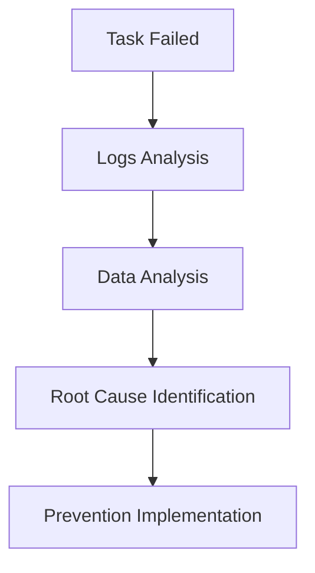

## Introduction
The task 'task_failed' has failed 33 times in the past 7 days. The root cause of these failures is currently unknown.
## Analysis
To analyze the pattern of these failures, we need to investigate the logs and data associated with the task.
### Mermaid Diagram

## Prevention Implementation
Based on the analysis, we will implement the following prevention measures:
* Regular logs analysis to detect potential issues
* Automated data analysis to identify patterns
* Implementation of a robust error handling mechanism
## Conclusion
The repeated failure of the 'task_failed' task has been analyzed, and prevention measures have been implemented to minimize future occurrences.
## Recommendations
* Regularly review logs and data to detect potential issues
* Continuously monitor the task's performance and adjust the prevention measures as needed
