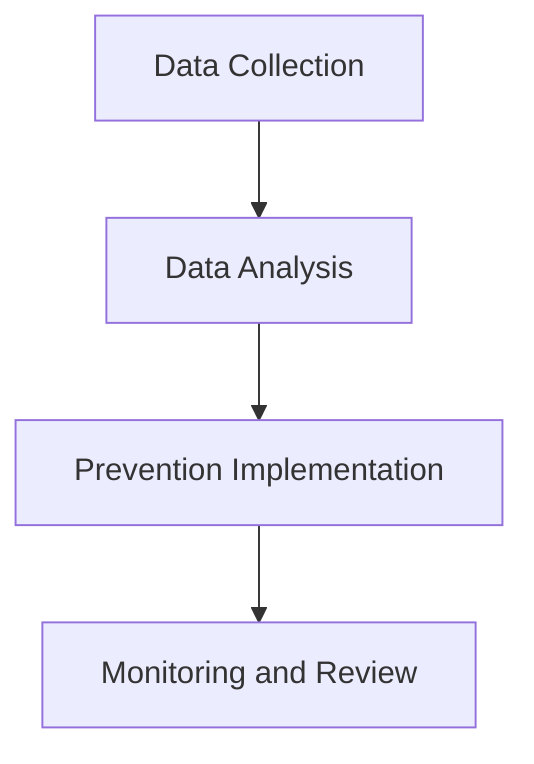

## Investigation of Repeated Failure: task_failed
The failure type has occurred 393 times in 7 days. To analyze the pattern and implement prevention, we need to identify the root causes.
### Step 1: Data Collection
Collecting data on the failures, including timestamps, error messages, and any relevant system logs.
### Step 2: Data Analysis
Analyzing the collected data to identify patterns or correlations that could indicate the root cause of the failures.
### Step 3: Prevention Implementation
Implementing measures to prevent future occurrences of the failure, based on the identified root causes.
### Visualization of the Process

This mermaid diagram illustrates the logical flow of the investigation and prevention process.