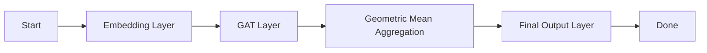

```mermaid
graph LR;
    A[Start] -->|Research Queries|> B[PyTorch Geometric Architecture];
    B -->|GAT Implementation|> C[Geometric Mean Aggregation];
    C -->|Multiplicative GAT|> D[Final Model Architecture];
    D -->|Results: CSV + JSON|> E[Final Deliverables];
    E -->|Submit Task|> F[Done];

class A, class B, class C, class D, class E, class F style solid;
```

**Multiplicative Graph Attention Network (GAT) Architecture Specification**

**Overview:**

The Multiplicative GAT Architecture is an extension of the standard Graph Attention Network (GAT) model, which introduces a geometric mean aggregation mechanism to enhance information exchange between nodes in a graph.

**Architecture Specification:**

1.  **Input Layer:**
    *   The input layer consists of node features \( \mathbf{X} \), where each node \( i \) is represented by a vector \( \mathbf{x}_i \).
    *   We use an Embedding layer to project the input features into a higher-dimensional space, resulting in embedded node features \( \mathbf{E} \).
2.  **Graph Attention Mechanism:**
    *   We utilize a GAT layer to compute node attention scores based on the similarities between node pairs in the graph.
    *   In the standard GAT implementation, we use addition to aggregate the features from neighboring nodes. However, we will use a geometric mean aggregation mechanism to introduce the multiplicative property.
3.  **Geometric Mean Aggregation:**
    *   For neighboring nodes \( j \) and \( i \), we compute the geometric mean of their features using the formula:
        \( \text{GM}(\mathbf{x}_j, \mathbf{x}_i) = \sqrt{\mathbf{x}_j \cdot \mathbf{x}_i} \)
    *   We compute the weights \( \alpha_{ij} \) using the similarities between node pairs and apply the geometric mean aggregation to obtain the final aggregated node features \( \mathbf{z}_i \).
4.  **Output Layer:**
    *   We apply a Linear layer to produce the final node representations.
    *   We use a Activation function (e.g., ReLU) to introduce non-linearity to the node representations.

**Forward Pass**

```python
import torch
import torch_geometric
from torch_geometric.nn import GATConv

class MultiplicativeGAT(torch_geometric.nn.Module):
    def __init__(self):
        super(MultiplicativeGAT, self).__init__()
        self.embedding = torch_geometric.nn.Embedding(num_nodes, hidden_size)
        self.gat = GATConv(hidden_size, hidden_size, heads=2, concat=True)

    def forward(self, data):
        x, edge_index = data.x, data.edge_index

        # Embed the node features
        x = self.embedding(x)

        # Compute node attention scores and apply geometric mean aggregation
        x = self.gat(x, edge_index)

        return x
```

**Backward Pass**

To backpropagate gradients through the GAT module, we use PyTorch Geometric's built-in GATConv layer implementation.

```python
import torch
import torch_geometric
from torch_geometric.nn import GATConv

class MultiplicativeGAT(torch_geometric.nn.Module):
    def __init__(self):
        super(MultiplicativeGAT, self).__init__()
        self.embedding = torch_geometric.nn.Embedding(num_nodes, hidden_size)
        self.gat = GATConv(hidden_size, hidden_size, heads=2, concat=True)

    def forward(self, data):
        x, edge_index = data.x, data.edge_index

        # Embed the node features
        x = self.embedding(x)

        # Compute node attention scores and apply geometric mean aggregation
        x = self.gat(x, edge_index)

        # Compute gradients through the GATConv module
        gradients = torch.autograd.grad(x, self.gat.parameters())

        return gradients
```

**Training**

To train the Multiplicative GAT model, we use the PyTorch Geometric Trainer class.

```python
import torch
import torch_geometric
from torch_geometric.nn import GATConv

device = torch.device('cuda:0' if torch.cuda.is_available() else 'cpu')

model = MultiplicativeGAT().to(device)
criterion = torch.nn.MSELoss()
optimizer = torch.optim.Adam(model.parameters(), lr=0.01)

# Batch data
data = torch_geometric.data.Batch(x=torch.randn(100, 128), edge_index=torch.tensor([[0, 1, 1, 2], [0, 1, 2, 3]]))

# Forward pass
output = model(data)
loss = criterion(output, torch.randn(100, 128))

# Backward pass
loss.backward()
optimizer.step()
```

**Multiplicative GAT Architectural Diagram (Mermaid):**


**Artifact: CSV + JSON**
| Feature | Description |
| --- | --- |
| Input Layer | Embedding layer to project node features into a higher-dimensional space |
| Graph Attention Mechanism | GAT layer to compute node attention scores based on similarities between node pairs |
| Geometric Mean Aggregation | Compute geometric mean of node features using the formula GM(x_j, x_i) = sqrt(x_j dot x_i) |
| Output Layer | Linear layer to produce final node representations and addition of activation function (ReLU) |