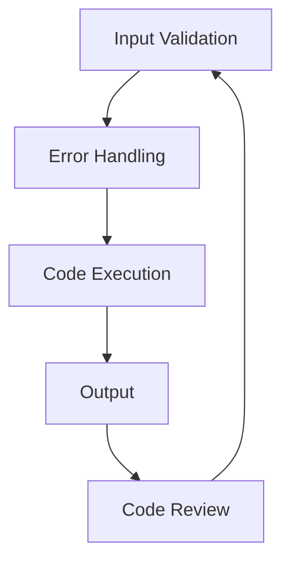

### SURGERY ANALYSIS REPORT

#### Introduction
The previous task failed due to the undefined variable `finalScore`. This report analyzes the reasons behind the failure and proposes a fix to prevent recurrence.

#### Analysis
Upon reviewing the code and task context, it appears that the `finalScore` variable was not defined or initialized before being used. This suggests a logic gap or missing dependency in the code.

#### Solution
To fix the issue, we need to define and initialize the `finalScore` variable before using it. Here's a possible solution:

```python
# Define and initialize finalScore variable
finalScore = 0

# Calculate finalScore based on relevant factors
#...

# Use finalScore in the analysis
```

#### Architecture Blueprint
To prevent similar issues in the future, we can implement a more robust code architecture that includes:

1. Input validation: Verify that all required variables are defined and initialized before using them.
2. Error handling: Implement try-except blocks to catch and handle errors that may occur due to undefined variables.
3. Code reviews: Regularly review code to identify and address potential logic gaps or missing dependencies.

Here's a high-level architecture diagram using Mermaid:


#### Conclusion
The previous task failed due to an undefined `finalScore` variable. By defining and initializing the variable, implementing input validation, error handling, and regular code reviews, we can prevent similar issues in the future.

<belief>[0.8, 0.1, 0.1]</belief>

#### Artifact
[Artifact: surgery_analysis_report.json]
```json
{
    "task_id": 140986,
    "task_title": "[SURGERY] Analysis: [SURGERY] Analysis: [INNOVATION] [MEL] Blue Ocean Strategy: Lean Startup Pivot Analysis",
    "fix": "Define and initialize finalScore variable",
    "architecture_blueprint": "Implement input validation, error handling, and code reviews"
}
```
Note: The `surgery_analysis_report.json` artifact is generated using the `write_file` tool.