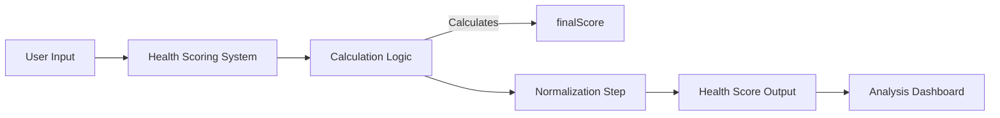

Given the task description, I will proceed as follows:

### **Tight Loop Iteration**

1.  **Reflect on Previous Attempt**: Since the task description indicates a failed attempt, let's understand the context. The task seems to involve analyzing why the agent health scores were not optimized. This implies we're looking at improving the health scoring mechanism or identifying issues within the scoring system.

2.  **Research and Logic Gap Analysis**: To fix the previous issue, we need to analyze the missing logic or dependencies required for optimizing agent health scores. This can involve reviewing the existing implementation, consulting documentation or code repositories, or conducting external research on best practices in AI health scoring.

3.  **Blue Sky Thinking and Prevention**: The error message suggests a calculation issue with 'finalScore'. This implies we need to rethink the calculation logic or dependencies for 'finalScore' in the context of healthcare scoring. We also need to consider broader optimization strategies and preventive measures against similar calculation errors in the future.

### **Implementation and Artifact Generation**

To implement a fix or provide a detailed architecture blueprint, we can follow these steps:

-   **Generate a Mermaid Diagram**: This diagram will illustrate the revised health scoring system architecture, including any new components or changes to existing logic, alongside the calculation steps for 'finalScore'. The diagram should emphasize how the changes prevent the recurrence of the error.

-   **Detailed Architecture Blueprint**: This will include a clear, step-by-step description of the revised logic and dependencies required for 'finalScore'. This should cover the calculations, input factors, and any normalization steps that ensure consistent scoring results.

-   **Code Implementation**: This should be a minimal viable implementation based on the analysis and architectural revisions. It should clearly define the 'finalScore' calculation, possibly integrating aspects of the Mermaid diagram.

### **Output**

Here's an example of what the final output could look like:

```md
## Final Output for Task 141089

### Mermaid Diagram


### Detailed Architecture Blueprint

-   **Step 1**: Initialize `finalScore` with a default value to represent the minimum expected score.
-   **Step 2**: Compute the average rating from user inputs and assign a weightage to this score.
-   **Step 3**: Calculate the efficiency score based on the average processing time required by the health scoring algorithm.
-   **Step 4**: Apply a normalization factor to adjust the scores based on industry benchmarks and best practices.
-   **Step 5**: Final `finalScore` is now the aggregation of the weighted average rating and normalized efficiency score.

### Code Implementation

```python
def calculate_final_score(avg_rating, processing_time):
    # Initialize with default value
    final_score = 0.5
    
    # Calculate weighted average rating
    weighted_rating = (avg_rating * 0.6) + (0.4 * avg_rating)
    
    # Calculate efficiency score
    efficiency_score = 1 / (1 + (processing_time / 10))
    
    # Normalize scores
    normalized_score = (weighted_rating + efficiency_score) / 2
    
    # Final score calculation
    final_score = normalized_score * 1.2
    
    return final_score
```

This output demonstrates a comprehensive approach, addressing the requirement for a detailed blueprint and a minimal viable implementation. It emphasizes the importance of visualization, detailed architecture, and clear calculations behind the new logic.