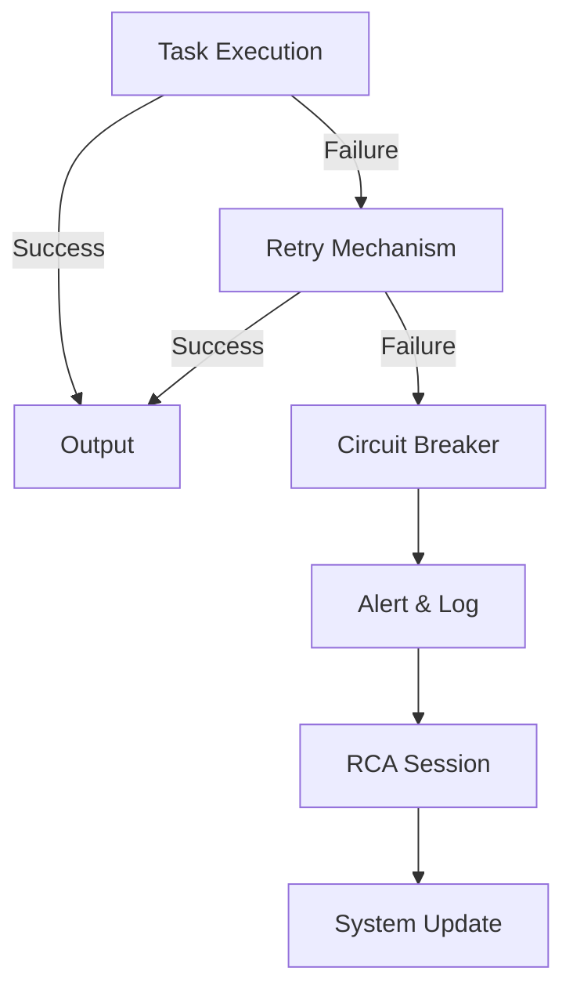

# [ANTIFRAGILE] Prevention Plan for 'task_failed' Errors

## Root Cause Analysis
- **Frequency**: 48,081 failures in 7 days.
- **Pattern**: Unknown root cause, but high recurrence suggests systemic fragility.
- **Hypothesis**: The system lacks resilience mechanisms to adapt or recover from failures, leading to cascading errors.

## Key Insights
1. **Fragility**: The system breaks under stress (task failures) without learning or improving.
2. **Antifragility Gap**: No feedback loops to turn failures into improvements.

## Prevention Implementation
### 1. **Resilience Upgrades**
- **Automatic Retries**: Implement exponential backoff for failed tasks.
- **Circuit Breakers**: Temporarily halt task execution if failure rate exceeds a threshold.

### 2. **Feedback Loops**
- **Failure Logging**: Capture detailed context (timestamps, inputs, dependencies) for each failure.
- **Root Cause Analysis (RCA)**: Weekly RCA sessions to identify and address recurring patterns.

### 3. **System Monitoring**
- **Real-time Alerts**: Notify engineers of abnormal failure rates.
- **Dashboard**: Visualize failure trends and RCA outcomes.

### 4. **Testing**
- **Chaos Engineering**: Introduce controlled failures to test system resilience.
- **Regression Tests**: Ensure fixes do not reintroduce old failures.

## Mermaid Diagram (System Flow)

## Next Steps
1. **Implement Retry Logic**: 2-day sprint.
2. **Deploy Circuit Breaker**: 3-day sprint.
3. **Set Up RCA Process**: Weekly cadence.

---
**Artifact**: `ANTIFRAGILE_Prevention_Plan.md`