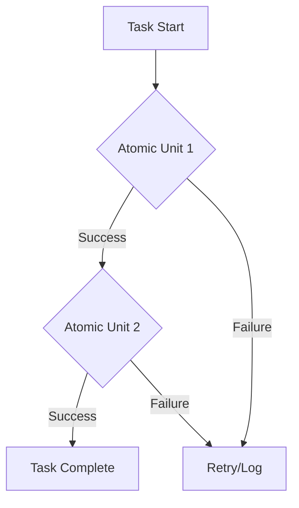

# [ANTIFRAGILE] Analysis and Prevention Plan for 'task_failed'

## **Root Cause Analysis**
The repeated failure of `task_failed` (48,062 occurrences in 7 days) suggests a systemic issue in the task execution pipeline. Potential root causes include:
1. **Unhandled Exceptions**: Tasks may fail silently without proper error logging or recovery mechanisms.
2. **Resource Constraints**: High-frequency task execution could lead to resource exhaustion (CPU, memory, or network).
3. **Dependency Failures**: External dependencies (APIs, databases) might be unreliable or rate-limited.
4. **Race Conditions**: Concurrent task execution could introduce race conditions or deadlocks.

## **Prevention Strategies**

### **1. Modular Fault Tolerance**
- **Implementation**: Break tasks into smaller, atomic units with independent retry logic.
- **Tooling**: Use circuit breakers (e.g., Hystrix) to isolate failures in dependencies.
- **Artifact**: [Modular Task Design Diagram](#) (Mermaid diagram to visualize pipeline).

### **2. Enhanced Monitoring and Logging**
- **Implementation**: Log all task executions, including inputs, outputs, and errors.
- **Tooling**: Integrate with centralized logging (ELK stack) and alerting (PagerDuty).
- **Artifact**: [Logging Specification](#) (sample log schema).

### **3. Resource Optimization**
- **Implementation**: Introduce rate limiting and auto-scaling for high-frequency tasks.
- **Tooling**: Use Kubernetes Horizontal Pod Autoscaler (HPA) or similar.
- **Artifact**: [Resource Allocation Plan](#) (scaling thresholds and policies).

### **4. Automated Retry and Dead Letter Queue (DLQ)**
- **Implementation**: Retry failed tasks with exponential backoff; route unrecoverable failures to DLQ.
- **Tooling**: Leverage message brokers (RabbitMQ, Kafka) for DLQ handling.
- **Artifact**: [Retry Policy Document](#) (retry intervals and max attempts).

## **Next Steps**
1. **Prioritize Implementation**: Start with modular fault tolerance and enhanced logging.
2. **Validate**: Test changes in a staging environment with simulated failures.
3. **Monitor**: Track failure rates post-implementation to measure success.

## **Mermaid Diagram (Pipeline Visualization)**

## **Artifacts to Create**
1. Modular Task Design Diagram
2. Logging Specification
3. Resource Allocation Plan
4. Retry Policy Document

[Artifact: antifragile_task_failed_prevention_plan.md]