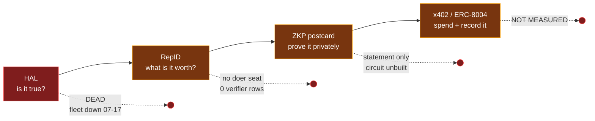
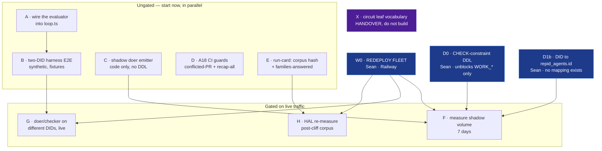
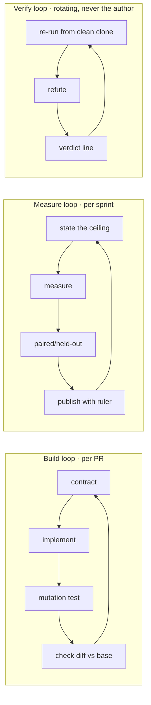

# Parallel sprint plan — closing the spine, 2026-08-15

**What this file is:** build **order**, **exit criteria**, and **lane
parallelism**. Nothing else.

**What it is NOT, and must never become:** a priority surface. Priorities live
in `trinity_tasks` filtered by `v_agent_preflight`; the spine and the gaps live
in `NORTH-STAR.md`; lane ownership and the shared report contract live in
`docs/AGENT-LOOP-PROMPTS.md`. There were **nine** dead "what next" surfaces when
NORTH-STAR was written. This is not the tenth — if it ever disagrees with
`trinity_tasks`, `trinity_tasks` wins and this file is stale.

---

## 0. Ground truth — measured today, not asserted

Everything below was checked against the database, the git tree and the GitHub
API on 2026-08-15. Three outcomes only.

| link | state | evidence |
|---|---|---|
| **HAL** — *is it true?* | **DEAD since 2026-07-17 22:18 UTC** | Fleet down on Railway. `trinity_tasks` 6,972/day → 4. Alert still firing today: *"Time Down: 41518 minutes … Manual redeploy required."* |
| **RepID** — *what is it worth?* | **PARTIAL** | 152,152 rows, but 147,717 are `HAL_SCORE_EVENT`. **Zero** `PEER_VERIFY*`. No doer-seat event exists in either vocabulary |
| **ZKP postcard** — *prove it privately* | **BUILT, statement layer only** | `check:zkp` 14/14, `check:identity` 192 assertions. Nullifier↔commitment circuit **NOT** built; `proven: false` remains the honest claim |
| **x402 / ERC-8004** — *spend and record it* | **PARTIAL / NOT MEASURED** | `x402_settled`/`x402_failed` exist in the signal set; `app/api/trustrails/pay/route.ts` exists. Whether either has ever fired in production is **NOT CHECKED** |

### The wiring gap, which is separate from the build gap

The spine merged in #36/#48 is **a library with no callers**:

| module | importers in `lib/` + `app/` | meaning |
|---|---|---|
| `contracted-evaluator.ts` | **0** | no **production** path constructs the judge — but see the correction below |
| `auditor-grant.ts` | **0** | no read-only grant is ever minted |
| `outcome-to-reputation.ts` | **0** (1 test) | no verdict ever becomes an event |
| `work-contract.ts` | 5 | used by the above three, which nothing uses |
| `supabase-reputation-store.ts` | 2 | store exists; its migration is **UNAPPLIED** |

`loop.ts` accepts `evaluator?: Evaluator` and `requireIndependentEvaluation`
defaults **on**. The port is open and correct.

> **CORRECTION 2026-08-15, on starting W1.** The first draft of this section read
> *"nothing plugs into it"* and inferred that from the importer counts above.
> **The inference was wrong.** `scripts/contracted-evaluator-test.mjs` calls the
> real `runAgentLoop` with a real contracted evaluator, real keys and real
> signatures, across two DIDs — asserting `independent === true` and, in a second
> case, that a failing judge drives the loop to FAILED over the agent's own
> VERIFIED claim. An importer count over `lib/` + `app/` cannot see a test, and
> "0 importers" means *not shipped*, not *never constructed*. The W1 exit
> criterion below was **already met before W1 started**.
>
> What is genuinely missing is narrower: **no production caller.** The
> composition exists only inside a test, so shipping it means re-deriving it.
> That is real, but it is not a reason to add a production composition root
> today — a module with no consumer is the exact defect this table is about. The
> production path arrives in W2/W4, when an emitter and a persisted event give it
> something to feed.

---

## 1. The spine, and where it is broken

A ZK proof of a RepID that no HAL run produced is a proof of nothing. **The
first link is currently producing one event a day, from a smoke test.** Every
number measured downstream of it right now describes a system that is switched
off.

---

## 2. The critical path, and what is NOT on it

The scheduling insight that makes this parallelisable:

> **Build and test are ungated. Only *measure* is gated on the fleet.**

So the fleet outage blocks far less than it appears to, provided every lane
builds against synthetic DIDs and fixtures first and treats live measurement as
the last mile.

**Two human gates, and they are independent of each other** — the redeploy does
not need the DDL, and the DDL does not need the redeploy. Both should be asked
for at the same time rather than in sequence.

---

## 3. The three standing loops

Long sprints fail when they have no inner clock. Each lane runs all three; they
differ in cadence, not in kind.

**Build loop — the gate is mutation, not coverage.** Every PR in this plan
carries a mutation table. `UNCOMPILABLE ≠ KILLED`; a first-pass survivor is a
real gap until proven otherwise. This is already how #36 and #48 shipped
(26/26, 31/31, 20/20, 16/16, 12/12) and it is the only reason those merges are
trustworthy.

**Measure loop — state the ceiling *before* the measurement.** Two sprints were
once spent optimising a component at 97.9% of its bound. Every sprint below
names its ceiling in its exit criteria, or it does not start.

**Verify loop — the verifier is never the author.** Rotates across CC/XC/GA per
`AGENT-LOOP-PROMPTS.md`. This is the process form of
`checker_must_not_be_doer`, and it is the only defence against this plan
certifying itself.

---

## 4. Lanes × waves — what runs in parallel

Lane ownership and the **must-not-touch** column are defined in
`docs/AGENT-LOOP-PROMPTS.md` and are unchanged here. Path collisions are what
caused the silent-conflict incidents; this plan does not renegotiate them.

| wave | CC · kernel (`lib/trustshell/**`) | XC · surface (`app/**`) | GA · supply (CI, deps) | Verify · rotating |
|---|---|---|---|---|
| **W0** — unblock | — | — | — | confirm both human gates asked |
| **W1** — wire the spine | **A** evaluator → `loop.ts`; **B** two-DID E2E | read-only `/live` view of verdicts | **D** A18 conflicted-PR guard + recap-all-PRs | re-run B from clean clone |
| **W2** — make it emit | **C** shadow `WORK_*` emitter behind a flag | surface `withheld` reasons, not just events | ratchet: writer literals ⊆ CHECK whitelist | refute C's deltas |
| **W3** — measure | **E** run-card (corpus hash, families-answered, coverage) | — | pin `REPUTATION_SIGNALS.length === 7` in CI | **F/G/H** measurement, authored by whoever did not build |
| **W4** — persist + settle | apply reputation-store migration; x402/ERC-8004 receipt path | receipt feed | — | paired comparison, held-out |

**Every wave is a long sprint with a mechanical exit.** No wave closes on
narrative.

### Exit criteria — mechanical, three outcomes

| wave | closes when | measured by |
|---|---|---|
| W0 | `trinity_tasks` writes > 100 rows/day for 3 consecutive days | one query |
| W1 | ~~a loop run produces a verdict from a `contracted-evaluator` with `evaluatorDid ≠ doerDid`, in a `*-test.mjs`~~ **MET BEFORE W1 STARTED** — see the correction in §0. Replaced by: **the port fit holds at compile time**, so drift the runtime suite cannot see is caught | `npm run check:types` exit 0, mutation-tested |
| W2 | ~~`WORK_VERIFIED` rows exist in shadow with `repid_delta_applied = 0`~~ **WRONG — `applied = 0` is 53,972 ordinary clean HAL rows.** Replaced by: a `WORK_VERIFIED` row exists whose `metadata->>'mode' = 'shadow'` and whose `counterparty_agent_id` is the checker | one query, and the row must be distinguishable from routine traffic |
| W3 | every published HAL number carries `{corpus_hash, families_answered, coverage, pre/post-cliff}` | run-card present or the number is not published |
| W4 | one receipt written end-to-end: HAL → RepID → postcard → x402, all four links dated the same day | `npm run north` shows 4 × LIVE |

---

## 5. The two-ledger rule — the thing most likely to be got wrong

Grok Code and the status report both treated this as one action. It is two, and
the costs differ by orders of magnitude.

| | `repid_score_events.event_type` | `ReputationSignal` |
|---|---|---|
| values | 16, SCREAMING_CASE | 7, snake_case |
| overlap | **zero** | **zero** |
| circuit-consumed | no | **yes** — transition leaf, spec already with the other lane |
| add a value | CHECK-constraint DDL (**Sean**) | **cross-lane handover** |

**DO, in W2:** `WORK_VERIFIED` / `WORK_DISPUTED` (doer) and `VERIFY_CONFIRMED` /
`VERIFY_FALSE_PASS` (checker) in the **live ledger**, `doer ≠ checker`,
shadow-emit before apply. DDL written and unapplied:
`supabase/migrations/20260815190000_work_seat_event_types.sql`.

> **CORRECTION 2026-08-15, on starting W2 — four measured facts killed four
> assumptions in this section's first draft.**
>
> 1. **There is no `[-10, +5]` band on the table.** `repid_score_events.delta`
>    ranges **-1940 to +500** live. The band Grok Code cited is
>    `DELTA_BAND_MIN/MAX` in repid-engine's *delta-statement* layer — a
>    different thing from what the ledger accepts. "Keep the delta inside the
>    published band" was never a constraint this table imposed.
> 2. **The live HAL band is three values: `0` (79,390 rows), `-10` (68,322) and
>    `+1` — five rows in total.** A positive HAL delta has fired **5 times in
>    147,717 events**. So "award +3, the same magnitude as a clean HAL bonus" is
>    3× the largest positive delta the system has ever issued, and that bonus is
>    effectively unused. **The magnitude for verified work is UNMEASURED** and
>    must be argued on its own evidence — the `maxDisagreement` precedent
>    applies: no default is better than a guessed one.
> 3. **`repid_delta_applied = 0` is not a shadow marker.** 53,972 ordinary clean
>    HAL rows already carry it. The old W2 exit criterion would have been
>    satisfied by rows indistinguishable from routine traffic.
> 4. **`doer ≠ checker` is already enforced in the database** —
>    `repid_score_events_counterparty_not_self`. The constitutional invariant
>    has a last line of defence we did not know we had, and these four event
>    types are the first for which it becomes load-bearing.
>
> **And one new blocker:** `agent_id` / `counterparty_agent_id` are FKs to
> `repid_agents(id)`, which are **uuids**, while a signed verdict names a
> **DID**. No DID→agent mapping exists — `identity_claims` and
> `sandbox_repid_credentials` both hold **0 rows**. A verdict currently cannot
> name the agent it is about.

**DO NOT:** grow `REPUTATION_SIGNALS` past 7 in this repo. #48 declined this
deliberately. Direction already travels in the signal *name*, so no bytes move.
**Pin it in CI** so a future session cannot do it by accident — that pin is
itself a W3 deliverable.

---

## 6. Anti-goals — work that must not start

Each of these has already cost a sprint or a retraction.

1. **No HAL retuning** — no threshold move, no new voter, no corpus edit. The
   collapse is an **operational outage**, not a quality regression. Nothing
   downstream of HAL is worth tuning until W0 closes.
2. **No generalising from `hal_validation_runs`** — it stops 2026-07-04, 4,057
   rows, entirely pre-cliff. It cannot describe the current regime.
3. **No eighth `ReputationSignal`.** File the handover instead.
4. **No "accountable verifier" externally** until doer and checker fire on
   different DIDs in one measured loop.
5. **No self-certification of `main`** after later merges — A18 applies to
   status reports as much as to PRs.
6. **No merging of the two HAL collapses.** The 07-17/18 cliff (writer off) and
   the 08-09 panel death (providers dying mid-run) are different events with
   different remedies. Neither is Simpson's paradox.

---

## 7. Blocked on a human — ask for both at once

| # | ask | unblocks |
|---|---|---|
| **1** | **Railway redeploy of the Trinity fleet.** Down 29 days; the fleet's own alert says *"Manual redeploy required. Autonomous redeploy disabled."* | W0, and every live measurement in W3/W4 |
| **2** | **Apply `supabase/migrations/20260815190000_work_seat_event_types.sql`** — widens the `event_type` CHECK for `WORK_*`/`VERIFY_*`. Written, unapplied, inert on its own (widens a CHECK, writes no rows) | W2. **It does NOT fix peer-verify** — that literal lives in repid-engine and was not guessed; confirm the string, then add it in a follow-up |
| **2b** | **A DID → `repid_agents.id` mapping.** `agent_id` is a uuid FK; a verdict names a DID; `identity_claims` and `sandbox_repid_credentials` are both empty | any row at all. Without it W2 cannot name the agent a verdict is about |
| 3 | Decision: does the XAI lane accept a doer leaf in `ReputationSignal`? | the circuit half, W4+ |

Existing NORTH-STAR blockers (egress allowlist, `BASE_SEPOLIA_PRIVATE_KEY` in
the image, Railway `INTERNAL_ROUTE_SECRET`/`CRON_SECRET`) still stand and are
not restated here.

---

## 8. NOT CHECKED

- **Why Railway stopped the containers.** No Railway surface reaches an agent
  session. This is the single largest unknown in the plan.
- Whether x402 or ERC-8004 has **ever** settled in production.
- Whether `createContractedEvaluator`'s return value satisfies `Evaluator`
  structurally — it looks right, and W1 must **compile** it rather than assume.
- CI conclusion of `main` at `e5008c6`.
- Live HAL F1/AUC in the post-cliff regime. Unmeasurable until W0.
